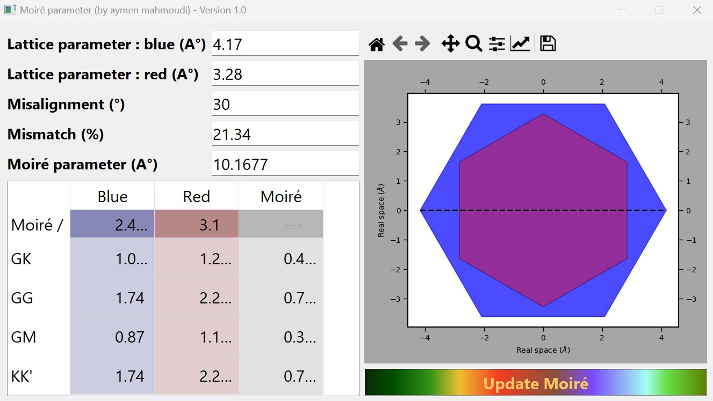

# Moiré parameter


## Description
Superposing two 2D materials with a rotational misalignment theta and a mismatch gamma can produce a Moiré. Superlattice structure defined by a lattice parameter lambda. Check this reference for the lambda formula : <a href="https://www.science.org/doi/10.1126/sciadv.abf4387" target="_blank">DOI: 10.1126/sciadv.abf4387</a></li>
<br>
This project helps to calculate the lattice parameter and the distance relations in the k-space for both TMDs and the generated Moiré system

 

## Usage
You need to provide the two lattice parameters of your two 2Ds (It is recommended to assign the bigger parameter to the blue hexagon form) and the misalignment between the two interfaces. Then, the mismatch, the moiré lattice parameter as well as the reciprocal parameter for the three structure will be generated.


## Installation
To use the app, you can download and directly execute the file moiré.exe (just for Windows X64). Otherwise, you can run the main.py script which is available within the necessary resources (I recommend the setup of python 3.8 python virtual environment).
<br>
I recommend to setup a python 3.8 virtual environment and adding the required libraries using the following command after cloning the rep (you can just download the rep in case you don't use git):
```console
pip install -r requirements.txt
```

## Roadmap
 <ul>
  <li>Avoid the crash of the app in case of empty value</li>
  <li>Transform the project on a desktop application</li>
</ul> 

## Support and Contributing
Let me know if you have any suggestions/ideas to enhance those scripts or add further settings. Your suggestions are warmly welcomed.
<br>
In case of a problem, It is strongly recommended to post an issue. For a more confidential demand, don't hesitate to email me.

## Acknowledgment
I thank Geoffroy Kremer for testing and checking formulas in k-space.  


